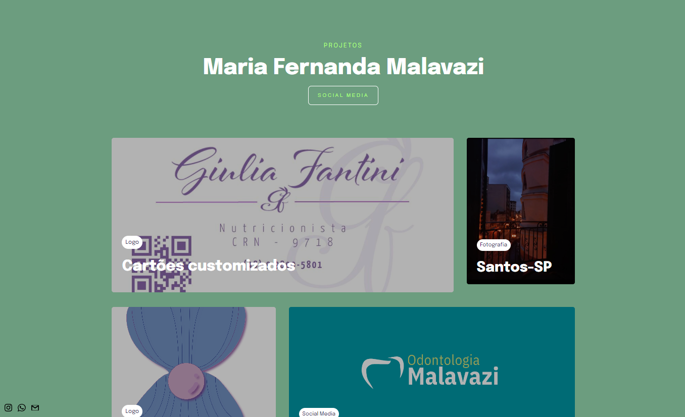

# Portfólio para cliente
 

> Feito para Maria Fernanada Malavazi

O projeto se trata de um Portfólio e foi feito utilizando os conceitos de HTML e CSS com responsividade de dispositivos diferentes.

## [🔗 Clique aqui para acessar o projeto](https://loren175.github.io/Portfolio-Mafe)
#

## 🚀 Tecnologias

- HTML
- CSS
- Git e Github

## 📞 Contato

>rafael.loren175@gmail.com

>+55 (11) 99959-9140

## 👾 Discord

>rafas#7622
